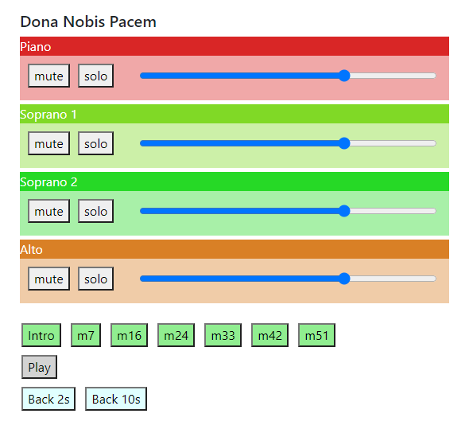

# stemmer.js
Simultaneous playback of multiple audio files on any device. See [getdunne.github.io](https://getdunne.github.io/stemmer.js/) for details.

**stemmer.js** is a simple web app which allows *simultaneous playback of multiple audio files* (aka “stems”), with a simple GUI to allow the listener to adjust each stem’s volume, mute and solo individual stems, and start playback from any of several pre-defined *cue points*.

The audio playback code is based on [Howler.js](https://github.com/goldfire/howler.js/). Responsive web layouts are based on [Twitter Bootstrap](https://getbootstrap.com/).
