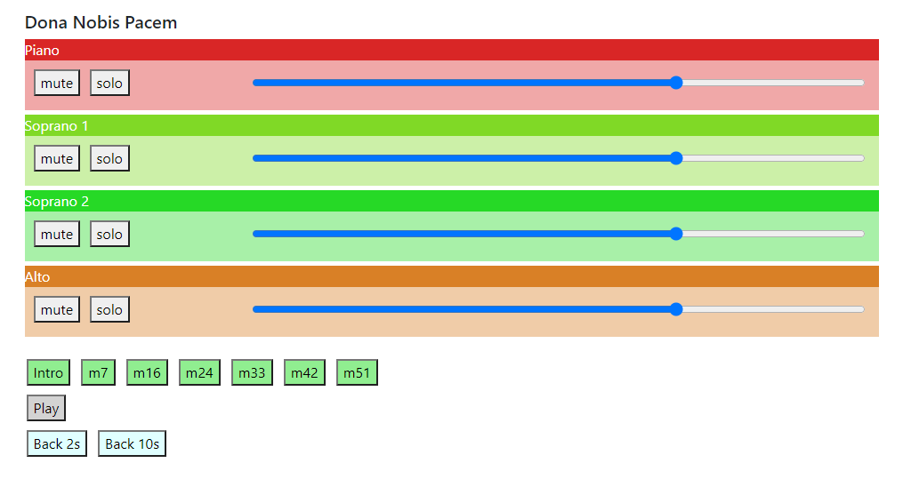
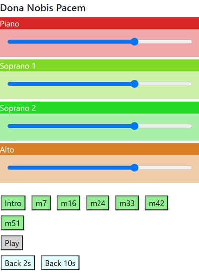

## Description

**stemmer.js** is a simple web app which allows simultaneous playback of multiple audio files (aka "stems"), with a simple GUI to allow the listener to adjust
each stem's volume, mute and solo individual stems, and start playback from any of several pre-defined _cue points_.

The main use-case is for choral singers needing to practice their parts at home during COVID-19 isolation. By using a set of stems instead of a single audio file, they can adjust the mix, mute or solo their own part, etc. If the choir wants to create a "virtual ensemble" performance video for e.g. YouTube, singers can also listen to the stems on headphones while recording their own part (audio and/or video) on another device.

The audio playback code is based on [Howler.js](https://github.com/goldfire/howler.js/). Responsive web layouts are based on
[Twitter Bootstrap](https://getbootstrap.com/).

I don't claim that this is a great web app, or a particularly good example of Howler.js usage, or JavaScript code, or (certainly not) HTML/CSS. It's
simply a starting point for a specific use-case (simultaneous playback of multiple audio files) which is not well-covered by the Howler.js documentation.
I very much hope that more competent developers will improve on what I have started.

### End-user interface

The basic stemmer.js web app provides an interface like this for the end-user:



For each of any number of audio files (stems), there is a colored strip containing the stem name, mute/solo buttons, and a level slider. Below this are three rows of buttons:
- The green buttons start playback (of all stems simultaneously) from different time-offsets (cue points)
- The grey Play/Pause button starts and stops playback
- The blue buttons rewind by 2 or 10 seconds

The layout is responsive, and when horizontal space is sufficiently tight (e.g., on a phone), the mute/solo buttons will not appear, like this:



### Configuration

The layouts shown above are generated automatically, based on a *song-setup.js* file like this:

```javascript
var songTitle = 'Dona Nobis Pacem';

var tracks = [
    { hue: 0, name: 'Piano', path: './stems/Piano.mp3' },
    { hue: 90, name: 'Soprano 1', path: './stems/Soprano1.mp3' },
    { hue: 120, name: 'Soprano 2', path: './stems/Soprano2.mp3' },
    { hue: 30, name: 'Alto', path: './stems/Alto.mp3' }
    ];

var skipTimes = [
    { name: 'Intro', timeSec: 0.0 },
    { name: 'm7', timeSec: 10.9 },
    { name: 'm16', timeSec: 35.6 },
    { name: 'm24', timeSec: 54.5 },
    { name: 'm33', timeSec: 74.5 },
    { name: 'm42', timeSec: 97.3 },
    { name: 'm51', timeSec: 118.3 }
    ];
```

The *hue* numbers in each track definition range from 0 to 360, and correspond to "hue" values in the [HSL Color naming system](https://www.w3schools.com/colors/colors_hsl.asp).
